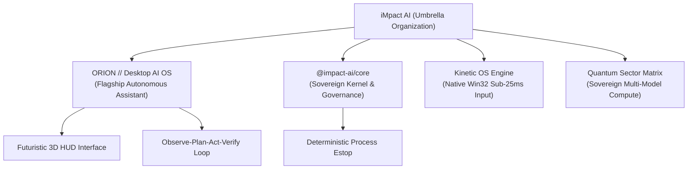

<div align="center">


# iMpact AI
### *Autonomous Sovereign Intelligence, Kinetic Agents & Desktop Operating Systems*

[](https://opensource.org/licenses/MIT)
[]()
[](https://github.com/iMpacts-AI/ORION)
[]()
[]()

**iMpact AI** is an advanced independent artificial intelligence engineering organization dedicated to building sovereign, autonomous operating systems and agentic infrastructure. Founded by independent builder Sheikh Saqib, iMpact develops closed-loop environments where intelligent agents perceive, reason, and actuate directly across native operating systems and real-world computational workflows.

[Official Website](https://impacts-ai.com) • [ORION OS Repository](https://github.com/iMpacts-AI/ORION) • [Core Framework](https://github.com/iMpacts-AI/iMpact) • [Inquiries](mailto:contact@impacts-ai.com)

---

</div>

## 🌐 The iMpact Ecosystem



### 1. [ORION (Flagship Desktop AI OS)](https://github.com/iMpacts-AI/ORION)
* **Category:** Autonomous Desktop AI Operating System
* **Architecture:** Electron 33, React 18, Three.js 3D Torus HUD, Win32 `user32.dll` native actuation, 1080p display buffer capture, and omnichannel neural routing.
* **Integrity:** 43/43 automated test suites passing in pure process isolation.

### 2. [iMpact Core Framework](https://github.com/iMpacts-AI/iMpact)
* **Category:** Sovereign AI Kernel & Deterministic Safety Framework
* **Architecture:** Observe-Plan-Act-Verify (OPAV) lifecycle, 4-tier risk classification, filesystem boundary containment, and multi-sector compute routing.
* **Integrity:** 23/23 core verification tests passing.

---

## 🔬 Global Research & Independent Builder Mission

iMpact AI is an independent builder initiative engaging with the global AI research and engineering ecosystem:
* **Research Focus:** Autonomous agentic workflows, sub-25ms kinetic computer control, multimodal visual grounding, and deterministic AI safety containment.
* **Academic & Fellowship Outreach:** We actively seek technical dialogue, peer review, and collaboration with university AI & Computer Science laboratories, research fellowships (Thiel, Rise, Emergent Ventures), and systems engineering institutions worldwide.

```
"Ideas are ideas. Implementation is the real deal. Measure honestly, build relentlessly, expand human agency."
— Sheikh Saqib, Founder of iMpact AI
```

---

<div align="center">

**iMpact AI — Shaping the Future of Sovereign Autonomous Computing.**  
*Dubai, UAE • [https://impacts-ai.com](https://impacts-ai.com) • [contact@impacts-ai.com](mailto:contact@impacts-ai.com)*

</div>
