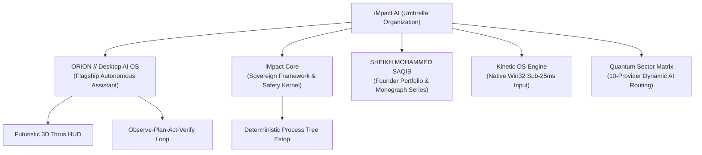

# iMpact AI
### *Autonomous Sovereign Intelligence, Kinetic Agents & Desktop Operating Systems*

 

> ### **NETWORK &bull; REASON &bull; IMPACT**
> *"The future of computational intelligence will not take place inside browser chat windows. It belongs to ambient, sovereign desktop operating systems capable of perceiving, reasoning, and actuating directly across native environments with kinetic precision."*  
> &mdash; **SHEIKH MOHAMMED SAQIB**, Founder & Chief AI Systems Architect

---

## 🌌 About iMpact AI

**iMpact AI** is an advanced independent artificial intelligence engineering organization dedicated to pioneering **sovereign autonomous operating systems**, **kinetic computer-use agents**, and **deterministic safety architectures**. 

Founded and directed by **[SHEIKH MOHAMMED SAQIB](https://github.com/iMpacts-AI/Sheikh-Mohammed-Saqib)**, iMpact develops closed-loop computational environments where intelligent agents perceive, reason, and actuate directly across native operating systems, developer toolchains, and real-world workflows without human bottlenecking or simulated virtualization.

---

## 🏛️ Ecosystem Overview & Core Repositories

### 1. 🌟 [ORION // Autonomous Desktop AI Operating System](https://github.com/iMpacts-AI/ORION)
* **Role:** Flagship Production Platform
* **Description:** A native autonomous desktop AI assistant and kinetic computer-use agent.
* **Capabilities:** 3D Planetary Torus HUD (React 18 + Three.js), sub-25ms Win32 cursor and keyboard actuation (`user32.dll`), 1080p optical frame perception, 10-provider omnichannel neural routing, and deterministic process-tree emergency stops.
* **Test Status:** 43/43 automated test suites passing in pure process isolation.

### 2. ⚡ [iMpact // Sovereign Intelligence Framework](https://github.com/iMpacts-AI/iMpact)
* **Role:** Sovereign AI Kernel & Multi-Sector Compute Matrix
* **Description:** The underlying architecture and safety framework powering the entire iMpact ecosystem.
* **Capabilities:** Closed-Loop O-P-A-V lifecycle, 4-tier risk classification matrix, filesystem boundary containment, and TITAN production validation pipeline.
* **Test Status:** 23/23 core verification tests passing.

### 3. 👑 [SHEIKH MOHAMMED SAQIB // Founder & Chief Architect Portfolio](https://github.com/iMpacts-AI/Sheikh-Mohammed-Saqib)
* **Role:** Executive Founder Showcase & Technical Monograph Series
* **Description:** The official portfolio, philosophy, and published essays of Founder & Chief Architect **SHEIKH MOHAMMED SAQIB**.
* **Featured Monographs:**
  * *The Death of the Chatbot Sandbox: Why the Future Belongs to Kinetic Desktop AI*
  * *Deterministic Safety Kernels: Governing Autonomous Computer-Use Agents at Machine Speed*
  * *Sovereign Multi-Sector Intelligence: Overcoming the Single-Provider Bottleneck*

---

## 📜 The Sovereign Manifesto

1. **Escaping the Sandbox:** Artificial intelligence must be liberated from passive chat widgets. It must become an active agent across the operating system—clicking buttons, dispatching terminal commands, observing displays, and manipulating local state.
2. **Deterministic Safety over Stochastic Hope:** Probabilistic models cannot audit their own destructive blast radius. Autonomy must be bounded by deterministic algorithmic filters, human-in-the-loop checkpoints, and instant hardware process-tree termination.
3. **Radical Multi-Provider Resilience:** Systems must never fail due to single-vendor outages or rate-limits. Intelligence must dynamically hot-swap across frontier models and local offline heuristics.

---

## 🔬 Global Research & Academic Collaboration

iMpact AI is an independent builder initiative engaging actively with the global AI research and engineering community:
* **Research Focus:** Autonomous agentic workflows, sub-25ms kinetic computer control, multimodal visual grounding, and deterministic AI safety containment.
* **Academic & Fellowship Outreach:** We actively seek technical dialogue, peer review, and collaboration with university AI & Computer Science laboratories, research fellowships (Thiel, Rise, Emergent Ventures), and systems engineering institutions worldwide.

---

**iMpact AI &bull; Shaping the Future of Sovereign Autonomous Computing.**  
*Official Portal: [https://impacts-ai.com](https://impacts-ai.com) &bull; Founder: [SHEIKH MOHAMMED SAQIB](https://github.com/iMpacts-AI/Sheikh-Mohammed-Saqib) &bull; Inquiries & Contact: [saqib@impacts-ai.com](mailto:saqib@impacts-ai.com)*

